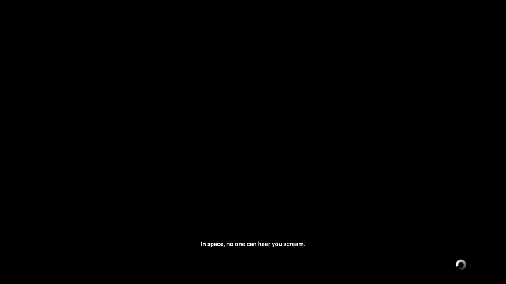

# Space Isolation (Plymouth Edition)
A Plymouth theme based on the loading screens of the 2014 survival horror game Alien: Isolation™.



## Installation
### Arch Linux
1. Download your resolution from [releases](https://github.com/callmenoodles/space-isolation-plymouth/releases) or clone this repository and change its name to *space-isolation*.
2. Make sure you have plymouth installed: https://wiki.archlinux.org/title/Plymouth
3. Copy the theme folder to `/usr/share/plymouth/themes`
  ```
  # cp -r /path/to/space-isolation /usr/share/plymouth/themes`
  ```
4. Set default Plymouth theme. Run this everytime you change or update the theme.
  ```
  # plymouth-set-default-theme -R space-isolation
  ```
5. (Optional) Add a delay to Plymouth if it loads too fast to enjoy the splash screen by editing `/etc/plymouth/plymouthd.conf` and adding:
  ```
  [Daemon]
  ShowDelay=<delay>
  ```
  Where `delay` is the delay in seconds (e.gs. 5).

## Known Issues
### Theme Size
The size of this theme can probably be optimized quite a bit. However, I was unable to get a preview running on my system, so I decided to just use the full snapshots of a screen recording of the game.

### Loading Screen Video
The game shows a low-res video sometimes while loading. When I included this, the theme size became too large. In hindsight I think I know how to fix this but another reason I didn't include it, is because it was very distracting having this flashing image while trying to enter my password at night. However, feel free to raise an issue.

### Fonts & Custom Text
AFAIK, fonts are not bundled with a Plymouth theme but must be installed on the host system already. I couldn't get fonts to work, so for now the quote you see is part of the background instead of editable.

### Question Mode
There is a question mode, which calls the function `on_mode_question` and can be set using `Plymouth.SetDisplayQuestionFunction(on_mode_question)` but I have no clue when this happens or what it is, so if you get this and it looks odd, I didn't know how to trigger it.

## Troubleshooting
### Boot Partition Full
> [!CAUTION]
> Deleting or changing the wrong files in `/boot` can "brick" your system.

If you get an error stating there is no space left after running rebuilding, try to remove temporary boot images.
1. Check `/boot`
```
$ ls /boot`
```
2. If you see any initramfs files ending in `.tmp`, you can delete them. The following command deletes all files ending in `.tmp`. Please be very careful with this.
```
# rm *.tmp
```

## Credits
Thanks to
- The people at [Gentoo](https://www.gentoo.org/) for [this wiki page](https://wiki.gentoo.org/wiki/User:DerpDays/Plymouth/Theming) on Plymouth theming.
- [@adi1090x](https://github.com/adi1090x) for [these Plymouth theme examples](https://github.com/adi1090x/plymouth-themes)
- [Creative Assembly](https://www.creative-assembly.com/) and [Sega](https://sega.com/) for the game
- [The Walt Disney Company](https://thewaltdisneycompany.com/) for supporting the Alien franchise (Is there anything Disney doesn't own lol)
